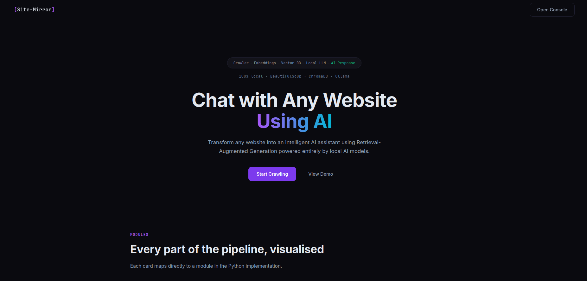
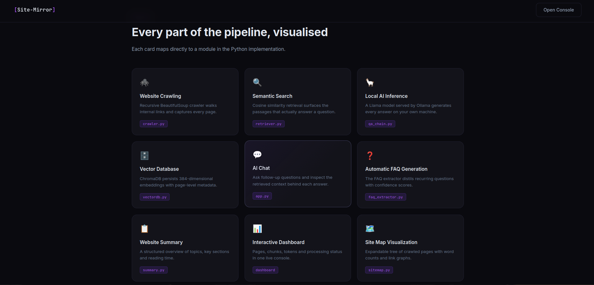
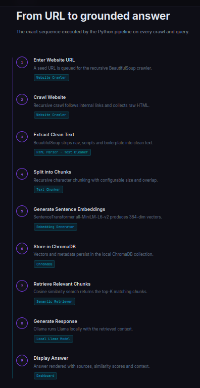
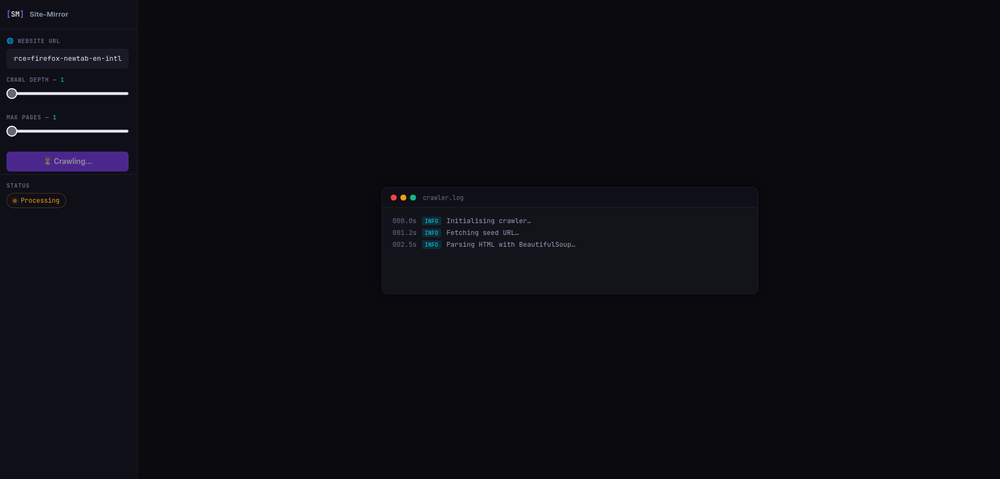
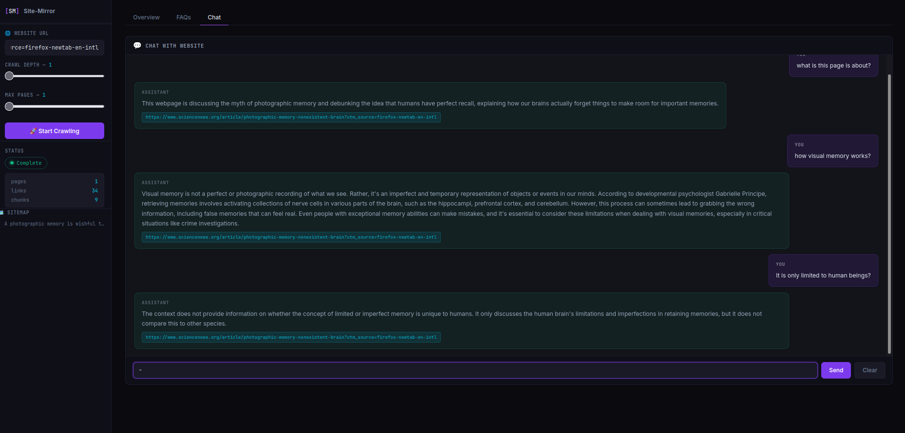

# Site-Mirror

> **Chat with any website using AI — powered by RAG and local LLM inference.**

Site-Mirror crawls a website, extracts and chunks its content, creates embeddings, stores them in ChromaDB, and uses semantic retrieval with a local Llama model through Ollama to answer questions.

## ✨ Features

- 🌐 Recursive website crawling with BeautifulSoup
- ✂️ Text cleaning and chunking
- 🧠 Semantic embeddings using 
- 🗄️ ChromaDB vector storage
- 🔎 Semantic search and relevant-context retrieval
- 🤖 Local Llama inference through Ollama
- 💬 History-aware chat with follow-up questions
- 💾 SQLite conversation history with conversation IDs
- ❓ Automatic FAQ generation
- 📋 Website summaries
- 🗺️ Sitemap visualization
- 📊 Interactive crawling dashboard

## 🔄 RAG Pipeline

```text
Website URL
    ↓
Web Crawler
    ↓
Clean Text → Chunking → Embeddings
    ↓
ChromaDB
    ↓
Conversation History → Query Rewriting
    ↓
Semantic Retrieval
    ↓
Local Llama + Ollama
    ↓
Grounded AI Response
```

## 🧠 History-Aware Chat

Conversation messages are stored in SQLite using a unique `conversation_id`. Previous messages are used to rewrite contextual follow-up questions into standalone queries before semantic retrieval.

Example:

```text
User: What technologies does this website use?
User: Which one is used for the backend?

        ↓ Query Rewriting

What technology is used for the website's backend?

        ↓ Retrieval → Llama → Answer
```

## 🛠️ Tech Stack

| Technology | Purpose |
|---|---|
| Python | Core application |
| Flask | Web backend |
| BeautifulSoup4 | Web crawling & HTML parsing |
| Sentence Transformers | Text embeddings |
| ChromaDB | Vector database |
| Ollama + Llama 3.1 8B | Local LLM |
| SQLite | Conversation history |
| HTML/CSS/JavaScript | Frontend |

## 📁 Main Modules

```text
crawler.py          → Website crawling
chunker.py          → Text chunking
embeddings.py       → Embeddings
vector_db.py        → ChromaDB
retriever.py        → Semantic retrieval
qa_chain.py         → RAG + LLM + query rewriting
database.py         → SQLite history
faq_extractor.py    → FAQ generation
summary.py          → Website summary
app.py              → Flask application
```

## 🖥️ Screenshots

### Landing Page


### Pipeline Modules


### RAG Pipeline


### Crawling Dashboard


### AI Chat


## 🚀 Getting Started

### 1. Clone the repository

```bash
git clone https://github.com/MahiiBamba/site-mirror-chatbot.git
cd site-mirror-chatbot
```

### 2. Install dependencies

```bash
pip install -r requirements.txt
```

### 3. Start Ollama

```bash
ollama serve
ollama pull llama3.1:8b
```

### 4. Run the application

```bash
python app.py
```

## 🎯 Why Site-Mirror?

Site-Mirror demonstrates a practical RAG system combining web crawling, embeddings, vector search, local LLM inference, and history-aware conversations.

## 🔮 Future Improvements

- Hybrid search and re-ranking
- Better JavaScript-heavy website support
- Multi-website knowledge bases
- Docker deployment
- Retrieval and answer-quality evaluation

## 📄 License

MIT
